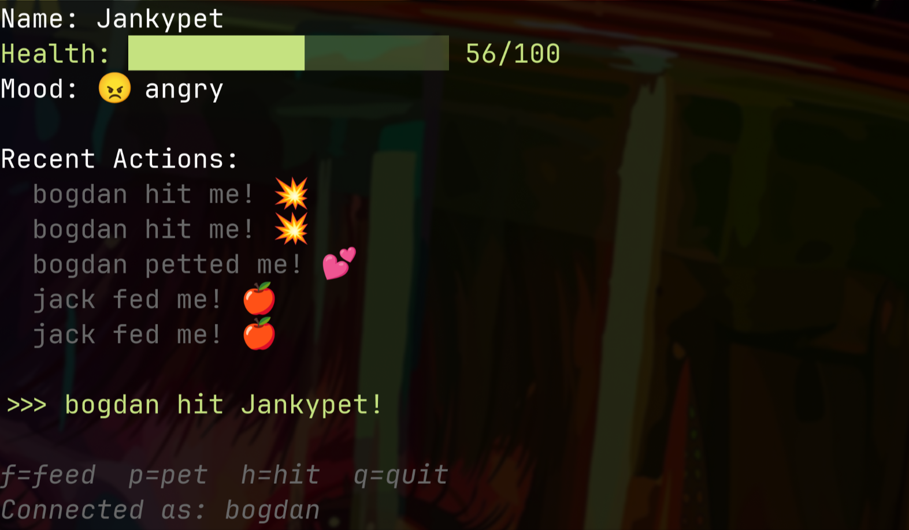

# 🐶 SSH Tamagotchi

Connect over SSH, compete with others to keep your pet alive!

Built with the amazing [Wish](https://github.com/charmbracelet/wish) and [Bubbletea](https://github.com/charmbracelet/bubbletea) libraries by Charm Bracelet.



## Usage

One server needs to run, with firewall permissions on port 23234

```bash
go run main.go
```

Clients can connect over SSH, assuming they are in the same network

```bash
ssh user@localhost -p 23234

# or

ssh user@<remotehost> -p 23234
```

## Development

```bash
nix develop -c dev-server
```
